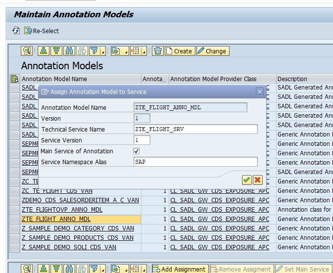

# Teched17

Work in progress

To install the code onto your ABAP system you will need to use the [abapGit](https://github.com/larshp/abapGit) project by [@larshp](https://github.com/larshp).

1. Import CDS Objects

Result

2. Maintain OData services

Once all objects are activated you will need to maintain the MPC, DPC and Annotation locations. The below screenshot shows where to find this in the IMG.

2 services 

Create Model

Create the corresponding Service and Assign the above Model to Service

Create the Annotation Model 

And assign the Annotation Model to the service

repeat the steps above for the OVP Service

Create Model

Create the corresponding Service and Assign the above Model to Service

Create the Annotation Model 

And assign the Annotation Model to the service

