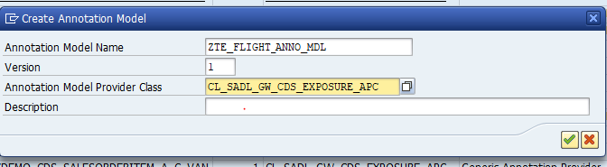
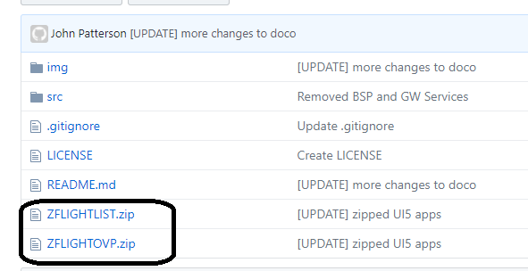

# :airplane: Demo Code

To install the code onto your ABAP system you will need to use the [abapGit](https://github.com/larshp/abapGit) project by [@larshp](https://github.com/larshp).

Steps to Install
=========

* [Import CDS Objects with abapGit](#import-cds-objects-with-abapgit)
* [Create OData services and models](#create-odata-services-and-models)
* [Activate Services](#activate-services)
* [Import SAPUI5 Applications](#import-sapui5-applications)

Import CDS Objects with abapGit
=========

Go into ZABAPGIT and clone this repo

Create a package for the code

Assign a transport

Activate the ABAP Objects

At the end of importing your package should look like

Create OData services and models
=========

Once all objects are activated you will need to maintain the MPC, DPC and Annotation locations. The below screenshot shows where to find this in the IMG.

Create Model **ZTE\_FLIGHT\_MDL** with Model Provider Class **ZCL\_TE\_FLIGHT\_MPC_EXT**
and Description **Model for Flight CDS**

Create the corresponding Service **ZTE\_FLIGHT\_SRV** with the Description **Service for Flight CDS** and Data Provider Class **ZCL\_TE\_FLIGHT\_DPC\_EXT**. Then assign the above Model to Service.

Create the Annotation Model **ZTE\_FLIGHT\_ANNO\_MDL** based on the Annotation Model Provider Class **CL\_SADL\_GW\_CDS\_EXPOSURE\_APC** with the description **Annotation for Flight CDS**

And assign the Annotation Model **ZTE\_FLIGHT\_ANNO\_MDL** to the **ZTE\_FLIGHT\_SRV** service

Repeat the same steps above for the OVP Service

Create Model ZTE\_FLIGHTOVP\_MDL with Model Provider Class **ZCL\_TE\_FLIGHTOVP\_MPC\_EXT**
and Description **Model for Flight OVP Service**

Create the corresponding Service **ZTE\_FLIGHTOVP\_SRV** with the Description **Service for Flight OVP CDS** and Data Provider Class **ZCL\_TE\_FLIGHTOVP\_DPC\_EXT**. Then assign the above Model **ZTE\_FLIGHTOVP\_MDL** to Service.

Create the Annotation Model **ZTE\_FLIGHTOVP\_ANNO\_MDL**  based on the Annotation Model Provider Class **CL\_SADL\_GW\_CDS\_EXPOSURE\_APC** with the description **Annotation for Flight OVP** and assign to the service **ZTE\_FLIGHTOVP\_SRV**

Activate Services
=========

Find the "Activate and Maintain Services" entry in the IMG

Select the "Add Selected Services" button, locate the 2 "ZTE\_FLIGHT*" Services and press "Add Selected Services"

Should see Service Creation in the log

Confirm by finding Services in list "Service Catalog" list

Import SAPUI5 applications
=========

The two SAPUI5 applications are zipped up and need to be imported manually

Download and extract the SAPUI5 zipfile [ZFLIGHTLIST](https://github.com/jasper07/Teched17/blob/master/ZFLIGHTLIST.zip?raw=true) to a tmp directory

call report /UI5/UI5_REPOSITORY_LOAD in SE38 and upload from tmp directory

Confirm and Upload

repeat for the [ZFLIGHTOVP](https://github.com/jasper07/Teched17/blob/master/ZFLIGHTOVP.zip?raw=true)
application
 

Confirm and Upload

now locate and run the ZFLIGHOVP app, should be somewhere like
http://server:port/sap/bc/ui5_ui5/sap/zflightovp/webapp/index.html?sap-client=001

Lastly you may need to create data for the Flight Data Model

Goto Transaction SE38 and run SAPBC_DATA_GENERATOR

## Enjoy :smiley: :airplane: