# :airplane: Demo Code

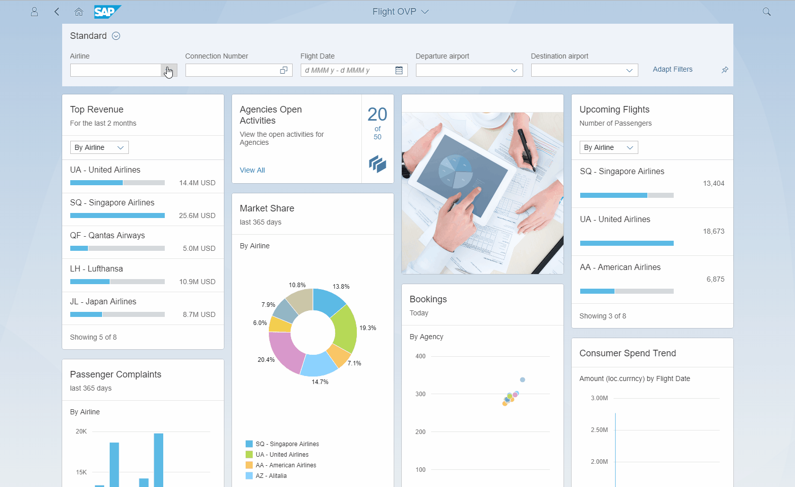

To install the code onto your ABAP system you will need to use the [abapGit](https://github.com/larshp/abapGit) project by [@larshp](https://github.com/larshp).

Steps to Install
=========

* [Import CDS Objects with abapGit](#import-cds-objects-with-abapgit)
* [Create OData services and models](#create-odata-services-and-models)
* [Activate Services](#activate-services)
* [Import SAPUI5 Applications](#import-sapui5-applications)

Import CDS Objects with abapGit
=========

Go into ZABAPGIT and clone this repo
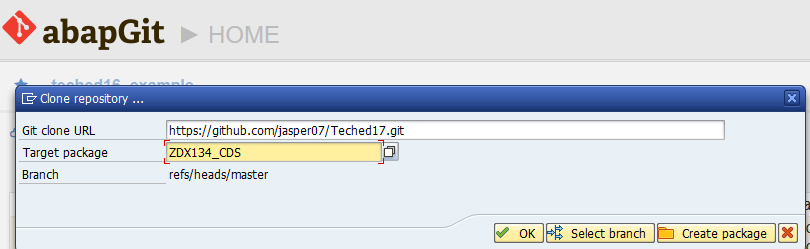

Create a package for the code

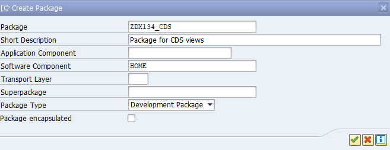

Assign a transport

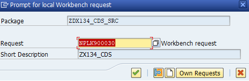

Activate the ABAP Objects
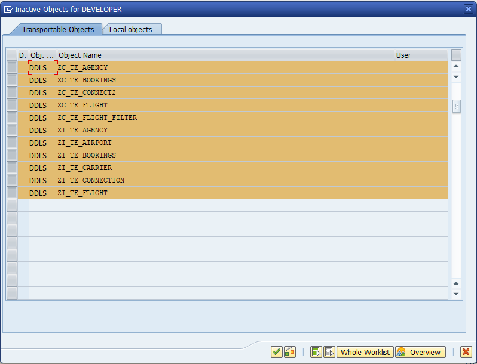

At the end of importing your package should look like
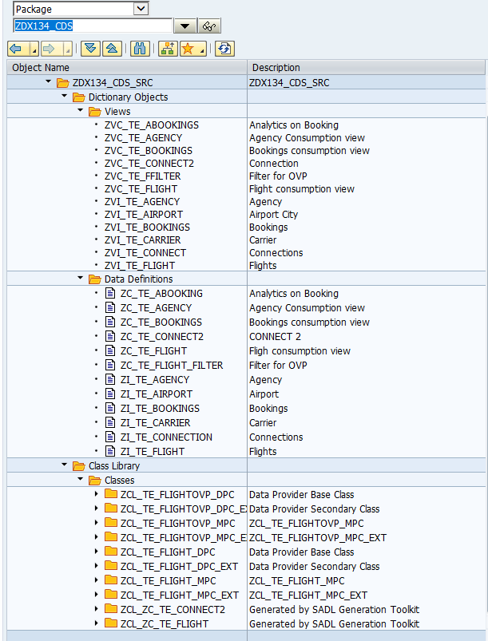

Create OData services and models
=========

Once all objects are activated you will need to maintain the MPC, DPC and Annotation locations. The below screenshot shows where to find this in the IMG.

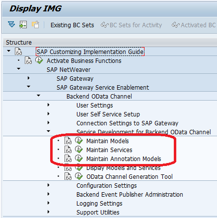

 

Create Model ZTE_FLIGHT_MDL
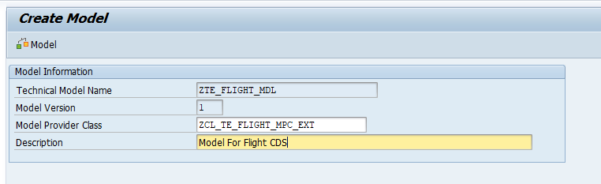

Create the corresponding Service  ZTE_FLIGHT_SRV and Assign the above Model to Service
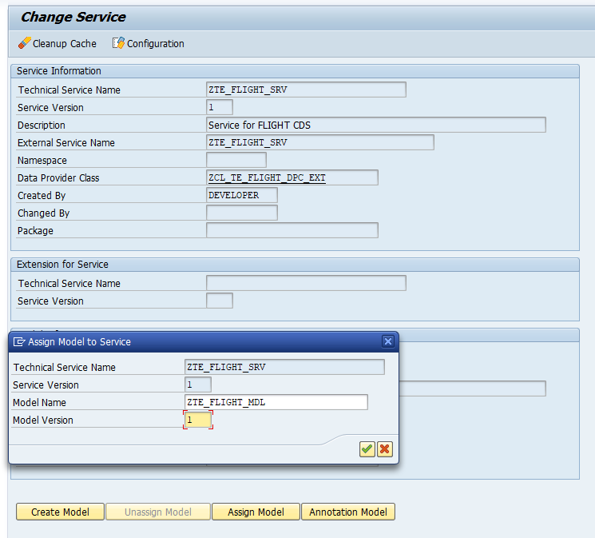

Create the Annotation Model ZTE_FLIGHTOVP_ANNO_MDL
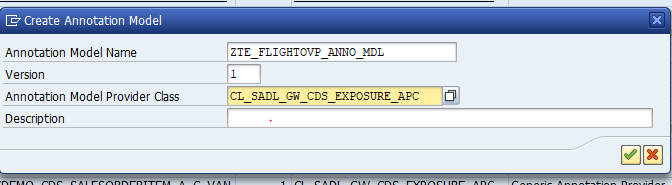

And assign the Annotation Model  ZTE_FLIGHTOVP_ANNO_MDL to the ZTE_FLIGHT_SRV service

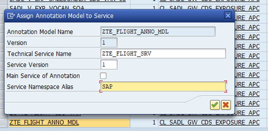

Repeat the same steps above for the OVP Service

Create Model ZTE_FLIGHTOVP_MDL

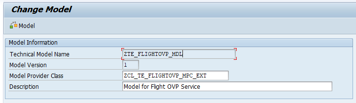

Create the corresponding Service ZTE_FLIGHTOVP_SRV and Assign the above Model ZTE_FLIGHTOVP_MDL to Service

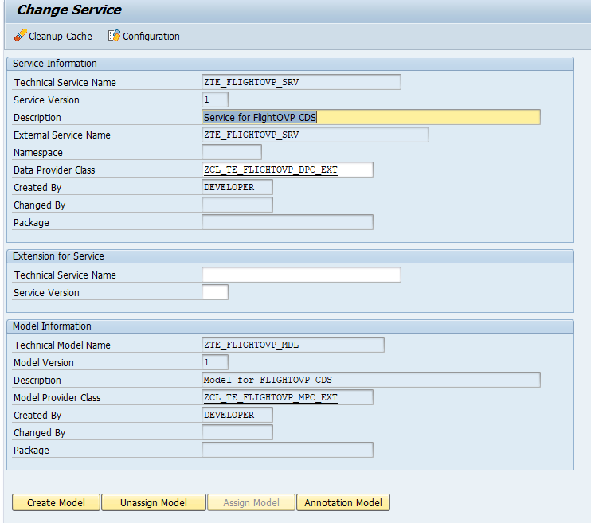

Create the Annotation Model ZTE_FLIGHTOVP_ANNO_MDL and assign to the service ZTE_FLIGHTOVP_SRV

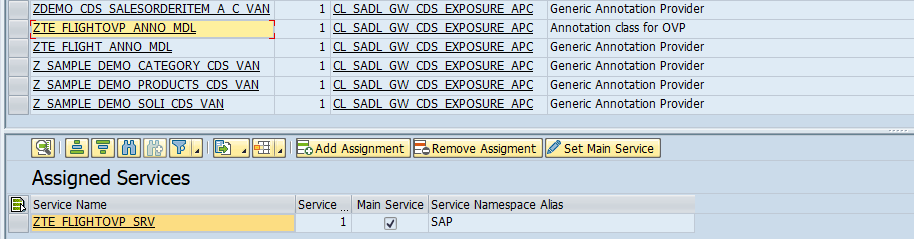

Activate Services
=========

Find the "Activate and Maintain Services" entry in the IMG

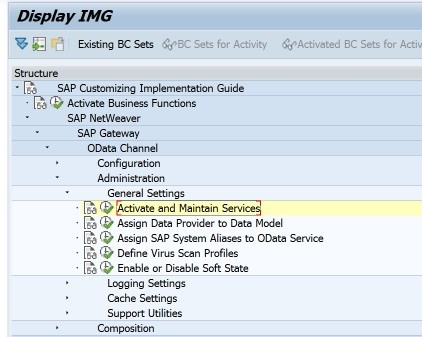

Select the "Add Selected Services" button, locate the 2 "ZTE_FLIGHT*" Services and press "Add Selected Services"

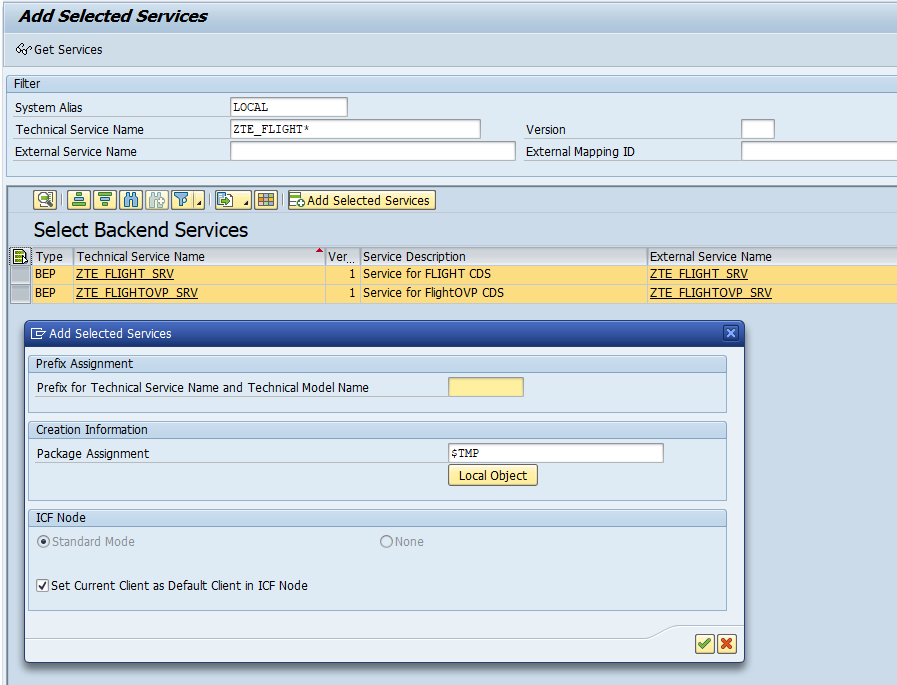

Should see Service Creation in the log
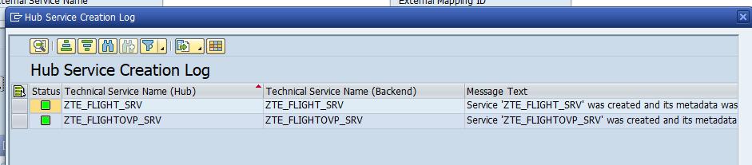

Confirm by finding Services in list "Service Catalog" list
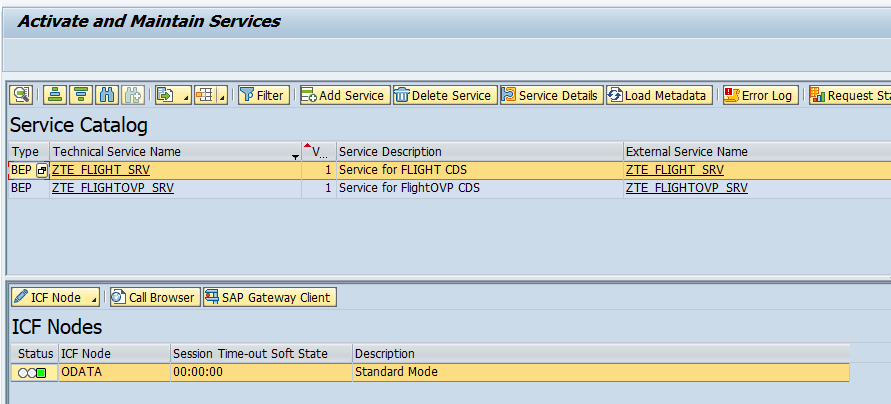

Import SAPUI5 applications
=========

Download and extract the SAPUI5  zipfile [ZFLIGHTLIST](https://github.com/jasper07/Teched17/blob/master/ZFLIGHTLIST.zip?raw=true) to a tmp directory

call report /UI5/UI5_REPOSITORY_LOAD in SE38 and upload from tmp directory
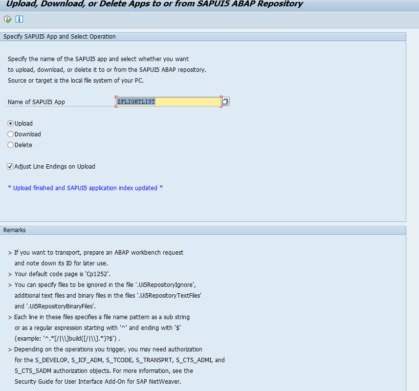

Confirm and Upload
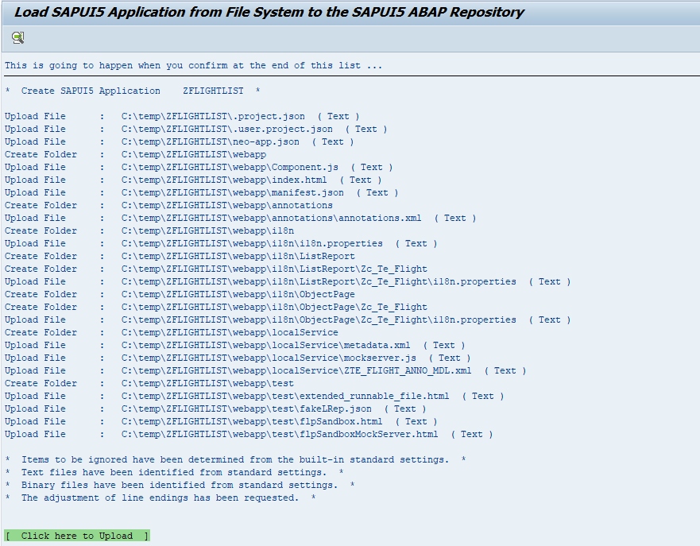

repeat for the [ZFLIGHTOVP](https://github.com/jasper07/Teched17/blob/master/ZFLIGHTOVP.zip?raw=true)
application
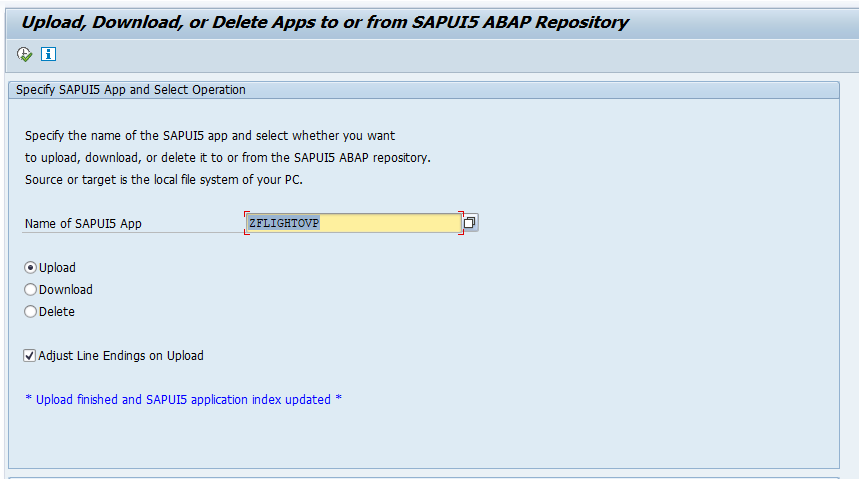 

Confirm and Upload
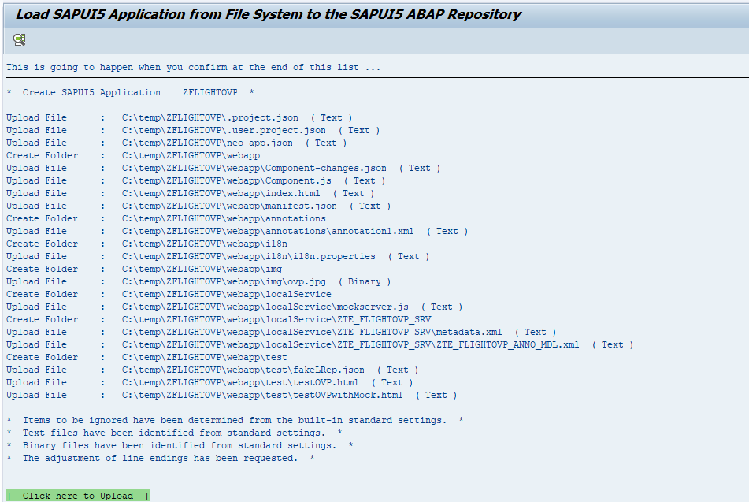

now locate and run the ZFLIGHOVP app, should be somewhere like
http://server:port/sap/bc/ui5_ui5/sap/zflightovp/webapp/index.html?sap-client=001

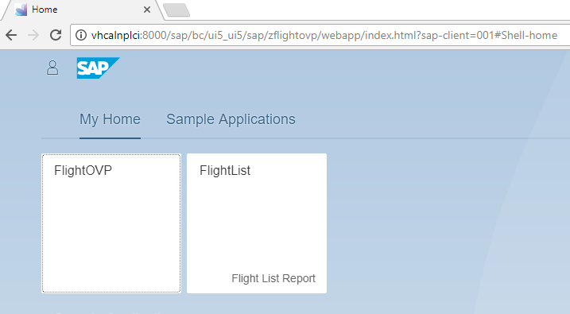

## Enjoy :smiley: :airplane: